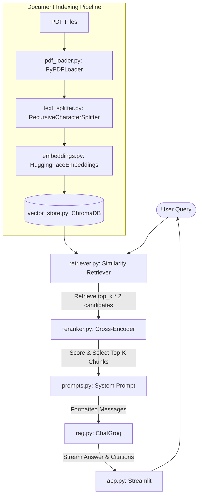

# Production-Quality PDF QA RAG Application

An production-grade Retrieval-Augmented Generation (RAG) system built in Python to perform grounded Question Answering over PDF documents. The application is designed to be clean, modular, and interview-ready.

---

## 📖 Table of Contents
1. [Project Overview](#-project-overview)
2. [Key Features](#-key-features)
3. [System Architecture](#-system-architecture)
4. [How RAG Works](#-how-rag-works)
5. [Folder Structure](#-folder-structure)
6. [Installation & Setup](#-installation--setup)
7. [Environment Variables](#-environment-variables)
8. [Sample Questions for Testing](#-sample-questions-for-testing)
9. [Technologies Used](#-technologies-used)
10. [Future Improvements](#-future-improvements)

---

## 🔍 Project Overview
This application parses one or more PDF files, creates structured text chunks, runs them through a HuggingFace sentence transformer to compute dense vector embeddings, and stores them in a local ChromaDB database. When users submit questions, the retriever queries ChromaDB for the Top-K relevant text passages and sends them as context to a Groq LLM (e.g., `llama-3.3-70b-versatile`) under strict prompt filters.

**Strict Grounding Rule**: The LLM will only answer using facts explicitly mentioned in the context. If the answer is not present, it will output:
`"I couldn't find that information in the uploaded documents."`

---

## ✨ Key Features
- **Multiple PDF Support**: Upload and index multiple PDF files concurrently.
- **Configurable RAG Parameters**: Interactive settings in the UI sidebar for chunk size, chunk overlap, and Top-K document retrieval.
- **Configurable Embedding Models**: Support for `sentence-transformers/all-MiniLM-L6-v2` and `BAAI/bge-small-en-v1.5`.
- **Streaming Responses**: Clean token-by-token text streaming in the chat interface.
- **Source Citations**: Renders interactive expanders detailing filenames and 1-indexed page numbers matching the retrieved content.
- **Database Control**: Clear and rebuild the vector database index directly via the UI.
- **Chat Management**: Clear the conversational history thread without deleting the document index.
- **Graceful Fallbacks**: Paste your Groq API key directly into the UI if the env variable is missing.

---

## 📐 System Architecture

The application uses a **two-stage retrieval architecture** to optimize relevance:



---

## 🛠️ How RAG Works
1. **Document Loading**: PyPDFLoader reads the PDF binary page-by-page, converting layout pages into document objects.
2. **Text Chunking**: Text is split recursively based on standard paragraph, sentence, and character boundaries (`\n\n`, `\n`, ` `, `""`) to keep coherent blocks of size $N$ characters with a slide overlap to maintain semantic continuity between boundary splits.
3. **Dense Vector Embeddings**: Text chunks are passed through a sentence-transformer model that maps words and sentences to dense floating-point vector spaces capturing semantic meaning.
4. **Vector Database**: ChromaDB stores the vectors and indexes them using Hierarchical Navigable Small World (HNSW) graphs.
5. **Semantic Retrieval**: Queries are converted into the same embedding space, and vector cosine similarity is computed. The top $K$ nearest vector chunks are retrieved.
6. **LLM Context Synthesis**: The LLM compiles the context alongside the query. It synthesizes a grounded answer, completely bounded from fabricating outside details.

---

## 📂 Folder Structure
```text
rag-project/
│
├── data/                    # Temporary folder storing uploaded PDF assets
├── chroma_db/               # Persistent SQLite-backed database files for Chroma
│
├── app.py                   # Streamlit web-based UI code
├── rag.py                   # Orchestration module binding LLM, retriever, and streaming
├── config.py                # Environment parser and static defaults config
│
├── pdf_loader.py            # PyPDF text extraction module
├── text_splitter.py         # Recursive text splitting wrapper with custom chunk_id
├── embeddings.py            # HuggingFace Embeddings wrapper
├── vector_store.py          # Chroma database manager (Init, Add, Clear)
├── retriever.py             # Similarity search configuration
├── reranker.py              # Cross-Encoder (ms-marco-MiniLM) Stage-2 Reranking
├── prompts.py               # Prompt templates & QA instructions
│
├── requirements.txt         # Project package dependencies
├── .env.example             # Template file for API keys
├── README.md                # System documentation
│
├── generate_sample_pdf.py   # Script to build sample.pdf
├── sample.pdf               # Mock corporate report containing testing facts
└── test_rag.py              # Diagnostic dry-run script
```

---

## 🚀 Installation & Setup

1. **Clone the project workspace** and navigate to the folder:
   ```bash
   cd Assessment/RAG
   ```

2. **Create and activate a virtual environment**:
   ```bash
   python -m venv venv
   # On Windows (cmd/powershell):
   venv\Scripts\activate
   # On MacOS/Linux:
   source venv/bin/activate
   ```

3. **Install the dependencies**:
   ```bash
   pip install -r requirements.txt
   ```

4. **Generate the testing sample PDF**:
   ```bash
   python generate_sample_pdf.py
   ```

5. **Configure environment keys**:
   Create a `.env` file from the example:
   ```bash
   copy .env.example .env
   ```
   Add your Groq API Key:
   ```text
   GROQ_API_KEY=gsk_your_groq_api_key_goes_here
   ```

6. **Run the diagnostic pipeline**:
   Ensure the retrieval works correctly before starting the web UI:
   ```bash
   python test_rag.py
   ```

7. **Launch the Streamlit App**:
   ```bash
   streamlit run app.py
   ```

---

## 🔑 Environment Variables
| Key | Type | Description | Required |
|-----|------|-------------|----------|
| `GROQ_API_KEY` | String | API key to run queries through ChatGroq. | Yes (or via UI fallback) |

---

## 💡 Sample Queries and Outputs

Below is a record of the actual Q&A sessions conducted using the RAG application:

*   **Query**: `According to the majority, what is the difference between residence and place of birth?`
    *   **Answer**: *"According to the provided context, the majority states that "residence and place of birth are two distinct conceptions with different connotations both in law and in fact". This implies that the majority recognizes a distinction between the two concepts, with residence referring to a person's permanent home or domicile, and place of birth referring to the location where a person was born."*
*   **Query**: `Who was the petetioner?`
    *   **Answer**: *"The petitioner was Shri D.P. Joshi."*
*   **Query**: `What relief did the petetioner seek?`
    *   **Answer**: *"The petitioner sought a writ restraining the authorities concerned from levying a capitation fee of Rs 1500 per annum on him."*
*   **Query**: `Which Articles of the Constitution were discussed?`
    *   **Answer**: *"The following Articles of the Constitution were discussed: Article 13, Article 14, Article 15(1), Article 32, and Article 44."*
*   **Query**: `What was the amount of capitation fee?`
    *   **Answer**: *"The amount of capitation fee was Rs 1300 for nominees and Rs 1500 for others."*
*   **Query**: `Explain the difference between domicile and residence.`
    *   **Answer**: *"According to the provided context, the difference between domicile and residence is explained as follows:
        - Domicile refers to a person's permanent home, which is the country or place that is considered by law to be their permanent home (Document 7).
        - Residence, on the other hand, refers to the place where a person actually lives or has their home (Document 2).
        - In other words, domicile is a legal concept that determines a person's personal laws and status, whereas residence is a more general term that refers to the place where a person currently lives (Document 5).
        - It is also mentioned that "domicile of origin" means "the domicile received by him at his birth", but it need not be the country where the infant is born, or the country where his parents are residing (Document 6).
        - In the context of the case, it is argued that the phrase "domicile in Madhya Bharat" is meant to convey the "place of birth" of the applicant, rather than their residence or permanent home (Document 3)."*
*   **Query**: `Why did the Court say Article 15 was not violated?`
    *   **Answer**: *"The Court said that when the rule-making authorities referred to domicile, they were thinking of residence, and therefore, the contention that the Rule is repugnant to Article 15(1) must fail."*
*   **Query**: `What was the respondent's argument?`
    *   **Answer**: *"The respondent's argument, as presented by the learned Attorney General, was that the Rule in question is a mere administrative or executive order and not a "law" as defined in Article 13. Therefore, Article 14 would not be applicable. The respondent relied on the decision in Om Prakash v. State to support this contention. Additionally, the respondent argued that as the institution was originally under private management and the State took it over subject to certain conditions, the State was bound to enforce the Rule relating to the payment of capitation fee that was previously in operation."*
*   **Query**: `Summarize the judgment in 5 points.`
    *   **Answer**: *"Based on the provided context, here are 5 points summarizing the judgment:
        1. The case of Shri D.P. Joshi vs. State of Madhya Bharat and Another was heard in the Supreme Court of India, with a bench consisting of B.K. Mukherjea, C.J., and other judges.
        2. The court considered the rules relevant to the case, but the exact authority for these rules, whether they are legislative or executive in nature, was not clearly established.
        3. The court discussed the concept of domicile and its relation to succession, citing the decision in Udny v. Udny, which recognizes that within one political unit, there can be multiple domiciles based on different systems of law.
        4. The Constitution confers the power to legislate on succession, marriage, and minority on both the Union and State Legislatures under Entry 5 in the Concurrent List.
        5. The petition ultimately failed, and the court dismissed it, with no order as to costs."*
*   **Query**: `What was the judge name`
    *   **Answer**: *"The judges mentioned in the document are: B.K. Mukherjea, C.J., Vivian Bose, J., Jagannadhas, J., T.L. Venkatarama Ayyar, J., B.P. Sinha, J."*
*   **Query**: `What were the lawyers name`
    *   **Answer**: *"The lawyers mentioned in the documents are: B.K. Mukherjea, C.J., Vivian Bose, J., B. Jagannadhas, J., T.L. Venkatarama Ayyar, J., B.P. Sinha, J., the learned Attorney General (name not specified), Lord Westbury, and Lord Somerville."*

*   **Query**: `Who is the prime minister of India during this case`
    *   **Answer**: *"I couldn't find that information in the uploaded documents."*
*   **Query**: `What is the capital of Japan`
    *   **Answer**: *"I couldn't find that information in the uploaded documents."*
    *   **Explanation**: These test cases demonstrate that the prompt constraints in `prompts.py` successfully restrict the LLM from utilizing external pre-trained world knowledge, ensuring all answers are fully grounded in the document context.

---

## 🛠️ Technologies Used
- **Streamlit**: Web frontend and interactive sidebar.
- **LangChain**: Application framework, Prompting, and LCEL abstractions.
- **ChatGroq**: High-speed inference using LLaMA models.
- **HuggingFace Embeddings**: Local text vector representation.
- **ChromaDB**: SQLite-backed local vector store.
- **ReportLab**: Programmatic PDF compilation.
- **PyPDF**: PDF text scanning.

---

## 🚀 Future Improvements
1. **Hybrid Retrieval**: Combine dense semantic embeddings with sparse keyword search (BM25) to improve acronym matching.
2. **Metadata Filtering**: Support filtering documents by file names, sizes, or dates directly in the retrieval query.
3. **Chunk Summary Pre-indexing**: Store parent-document summaries alongside chunks to improve macro-level context matching.
4. **Conversation History Memory**: Implement conversational context retrieval by compressing preceding dialogue inside a contextualizer chain.
